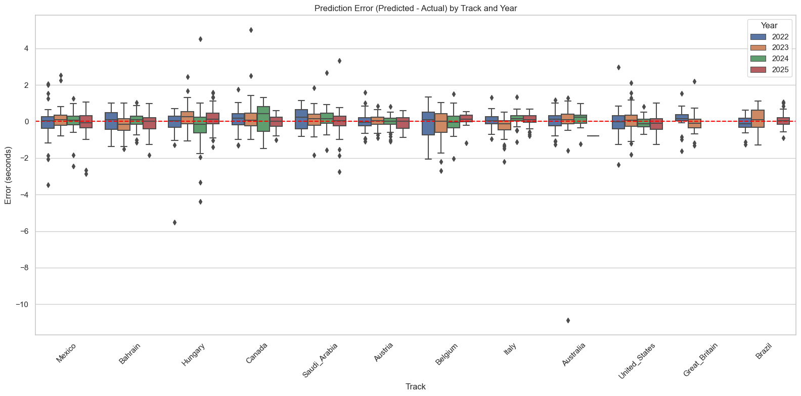
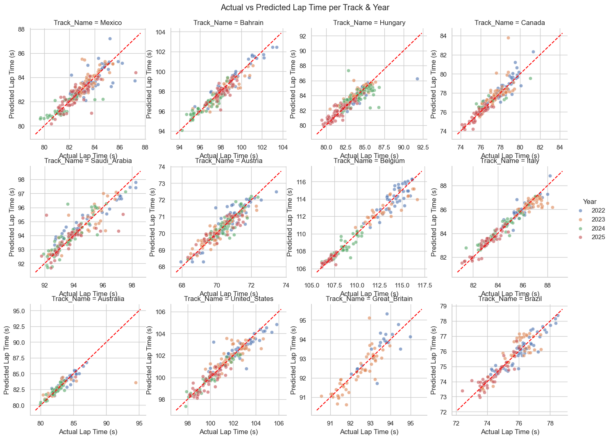

# F1 Lap Time Prediction — Multi-Circuit XGBoost Model

**Model:** XGBoost Regressor  
**Inputs:** Driver, Track, LapNumber, Compound, TyreLife, Year  
**Target:** LapTime (seconds)  

Only drivers who maintained the same team across all 4 years are included:  
ALB (Williams), LEC (Ferrari), NOR (McLaren), RUS (Mercedes), VER (Red Bull)


```python
import os
import glob
import numpy as np
import pandas as pd
import matplotlib.pyplot as plt
import seaborn as sns

from xgboost import XGBRegressor
from sklearn.model_selection import train_test_split
from sklearn.metrics import mean_squared_error, mean_absolute_error, r2_score
from sklearn.preprocessing import LabelEncoder

sns.set_theme(style="whitegrid")
```


```python
# Target circuits
TRACKS = [
    'Australia', 'Bahrain', 'Saudi_Arabia',
    'Canada', 'Austria', 'Great_Britain', 'Hungary', 'Belgium',
    'Italy', 'United_States', 'Mexico', 'Brazil'
]

df_list = []

for track in TRACKS:
    files = sorted(glob.glob(f'datasets/{track}/*_Laps.csv'))
    for f in files:
        temp_df = pd.read_csv(f, low_memory=False)
        year = int(os.path.basename(f).split('_')[0])
        temp_df['Year'] = year
        temp_df['Track'] = track
        df_list.append(temp_df)
        print(f"Loaded {len(temp_df)} laps from {f}")

df = pd.concat(df_list, ignore_index=True)
print(f"\nTotal laps loaded: {len(df)}")
df.head()
```

    Loaded 1045 laps from datasets/Australia\2022_Australia_Laps.csv
    Loaded 1003 laps from datasets/Australia\2023_Australia_Laps.csv
    Loaded 998 laps from datasets/Australia\2024_Australia_Laps.csv
    Loaded 927 laps from datasets/Australia\2025_Australia_Laps.csv
    Loaded 1125 laps from datasets/Bahrain\2022_Bahrain_Laps.csv
    Loaded 1056 laps from datasets/Bahrain\2023_Bahrain_Laps.csv
    Loaded 1129 laps from datasets/Bahrain\2024_Bahrain_Laps.csv
    Loaded 1128 laps from datasets/Bahrain\2025_Bahrain_Laps.csv
    Loaded 820 laps from datasets/Saudi_Arabia\2022_Saudi_Arabia_Laps.csv
    Loaded 943 laps from datasets/Saudi_Arabia\2023_Saudi_Arabia_Laps.csv
    Loaded 901 laps from datasets/Saudi_Arabia\2024_Saudi_Arabia_Laps.csv
    Loaded 898 laps from datasets/Saudi_Arabia\2025_Saudi_Arabia_Laps.csv
    Loaded 1264 laps from datasets/Canada\2022_Canada_Laps.csv
    Loaded 1317 laps from datasets/Canada\2023_Canada_Laps.csv
    Loaded 1272 laps from datasets/Canada\2024_Canada_Laps.csv
    Loaded 1349 laps from datasets/Canada\2025_Canada_Laps.csv
    Loaded 1324 laps from datasets/Austria\2022_Austria_Laps.csv
    Loaded 1354 laps from datasets/Austria\2023_Austria_Laps.csv
    Loaded 1405 laps from datasets/Austria\2024_Austria_Laps.csv
    Loaded 1127 laps from datasets/Austria\2025_Austria_Laps.csv
    Loaded 815 laps from datasets/Great_Britain\2022_Great_Britain_Laps.csv
    Loaded 971 laps from datasets/Great_Britain\2023_Great_Britain_Laps.csv
    

    Loaded 1383 laps from datasets/Hungary\2022_Hungary_Laps.csv
    Loaded 1252 laps from datasets/Hungary\2023_Hungary_Laps.csv
    Loaded 1355 laps from datasets/Hungary\2024_Hungary_Laps.csv
    Loaded 1368 laps from datasets/Hungary\2025_Hungary_Laps.csv
    Loaded 792 laps from datasets/Belgium\2022_Belgium_Laps.csv
    Loaded 816 laps from datasets/Belgium\2023_Belgium_Laps.csv
    Loaded 841 laps from datasets/Belgium\2024_Belgium_Laps.csv
    Loaded 879 laps from datasets/Belgium\2025_Belgium_Laps.csv
    Loaded 971 laps from datasets/Italy\2022_Italy_Laps.csv
    Loaded 958 laps from datasets/Italy\2023_Italy_Laps.csv
    Loaded 1008 laps from datasets/Italy\2024_Italy_Laps.csv
    Loaded 975 laps from datasets/Italy\2025_Italy_Laps.csv
    Loaded 992 laps from datasets/United_States\2022_United_States_Laps.csv
    Loaded 1014 laps from datasets/United_States\2023_United_States_Laps.csv
    Loaded 1059 laps from datasets/United_States\2024_United_States_Laps.csv
    Loaded 1067 laps from datasets/United_States\2025_United_States_Laps.csv
    Loaded 1379 laps from datasets/Mexico\2022_Mexico_Laps.csv
    Loaded 1282 laps from datasets/Mexico\2023_Mexico_Laps.csv
    Loaded 1215 laps from datasets/Mexico\2024_Mexico_Laps.csv
    Loaded 1263 laps from datasets/Mexico\2025_Mexico_Laps.csv
    

    Loaded 1259 laps from datasets/Brazil\2022_Brazil_Laps.csv
    Loaded 1109 laps from datasets/Brazil\2023_Brazil_Laps.csv
    Loaded 1135 laps from datasets/Brazil\2024_Brazil_Laps.csv
    Loaded 1251 laps from datasets/Brazil\2025_Brazil_Laps.csv
    
    Total laps loaded: 50794
    


<div>
<style scoped>
    .dataframe tbody tr th:only-of-type {
        vertical-align: middle;
    }

    .dataframe tbody tr th {
        vertical-align: top;
    }

    .dataframe thead th {
        text-align: right;
    }
</style>
<table border="1" class="dataframe">
  <thead>
    <tr style="text-align: right;">
      <th></th>
      <th>Time</th>
      <th>Driver</th>
      <th>DriverNumber</th>
      <th>LapTime</th>
      <th>LapNumber</th>
      <th>Stint</th>
      <th>PitOutTime</th>
      <th>PitInTime</th>
      <th>Sector1Time</th>
      <th>Sector2Time</th>
      <th>...</th>
      <th>LapStartTime</th>
      <th>LapStartDate</th>
      <th>TrackStatus</th>
      <th>Position</th>
      <th>Deleted</th>
      <th>DeletedReason</th>
      <th>FastF1Generated</th>
      <th>IsAccurate</th>
      <th>Year</th>
      <th>Track</th>
    </tr>
  </thead>
  <tbody>
    <tr>
      <th>0</th>
      <td>0 days 01:03:43.963000</td>
      <td>VER</td>
      <td>1</td>
      <td>0 days 00:01:30.342000</td>
      <td>1.0</td>
      <td>1.0</td>
      <td>NaT</td>
      <td>NaT</td>
      <td>NaT</td>
      <td>0 days 00:00:18.652000</td>
      <td>...</td>
      <td>0 days 01:02:13.396000</td>
      <td>NaT</td>
      <td>1</td>
      <td>2.0</td>
      <td>NaN</td>
      <td>NaN</td>
      <td>False</td>
      <td>False</td>
      <td>2022</td>
      <td>Australia</td>
    </tr>
    <tr>
      <th>1</th>
      <td>0 days 01:05:08.794000</td>
      <td>VER</td>
      <td>1</td>
      <td>0 days 00:01:24.831000</td>
      <td>2.0</td>
      <td>1.0</td>
      <td>NaT</td>
      <td>NaT</td>
      <td>0 days 00:00:29.719000</td>
      <td>0 days 00:00:18.536000</td>
      <td>...</td>
      <td>0 days 01:03:43.963000</td>
      <td>NaT</td>
      <td>12</td>
      <td>2.0</td>
      <td>NaN</td>
      <td>NaN</td>
      <td>False</td>
      <td>True</td>
      <td>2022</td>
      <td>Australia</td>
    </tr>
    <tr>
      <th>2</th>
      <td>0 days 01:06:54.969000</td>
      <td>VER</td>
      <td>1</td>
      <td>0 days 00:01:46.175000</td>
      <td>3.0</td>
      <td>1.0</td>
      <td>NaT</td>
      <td>NaT</td>
      <td>0 days 00:00:29.540000</td>
      <td>0 days 00:00:27.197000</td>
      <td>...</td>
      <td>0 days 01:05:08.794000</td>
      <td>NaT</td>
      <td>264</td>
      <td>2.0</td>
      <td>NaN</td>
      <td>NaN</td>
      <td>False</td>
      <td>False</td>
      <td>2022</td>
      <td>Australia</td>
    </tr>
    <tr>
      <th>3</th>
      <td>0 days 01:09:09.241000</td>
      <td>VER</td>
      <td>1</td>
      <td>0 days 00:02:14.272000</td>
      <td>4.0</td>
      <td>1.0</td>
      <td>NaT</td>
      <td>NaT</td>
      <td>0 days 00:00:40.308000</td>
      <td>0 days 00:00:30.646000</td>
      <td>...</td>
      <td>0 days 01:06:54.969000</td>
      <td>NaT</td>
      <td>4</td>
      <td>2.0</td>
      <td>NaN</td>
      <td>NaN</td>
      <td>False</td>
      <td>False</td>
      <td>2022</td>
      <td>Australia</td>
    </tr>
    <tr>
      <th>4</th>
      <td>0 days 01:11:22.770000</td>
      <td>VER</td>
      <td>1</td>
      <td>0 days 00:02:13.529000</td>
      <td>5.0</td>
      <td>1.0</td>
      <td>NaT</td>
      <td>NaT</td>
      <td>0 days 00:00:44.387000</td>
      <td>0 days 00:00:30.247000</td>
      <td>...</td>
      <td>0 days 01:09:09.241000</td>
      <td>NaT</td>
      <td>4</td>
      <td>2.0</td>
      <td>NaN</td>
      <td>NaN</td>
      <td>False</td>
      <td>False</td>
      <td>2022</td>
      <td>Australia</td>
    </tr>
  </tbody>
</table>
<p>5 rows × 33 columns</p>
</div>


```python
df = df.replace("NaT", np.nan)

# --- Eligible drivers (same team across 2022-2025) ---
ELIGIBLE_DRIVERS = ['ALB', 'LEC', 'NOR', 'RUS', 'VER']

print(f"Starting rows: {len(df)}")

# 1. Keep only eligible drivers
df = df[df['Driver'].isin(ELIGIBLE_DRIVERS)].copy()
print(f"After filtering eligible drivers: {len(df)}")

# 2. Convert LapTime from timedelta string to seconds
if df['LapTime'].dtype == 'object':
    df['LapTime'] = pd.to_timedelta(df['LapTime']).dt.total_seconds()

# 3. Drop rows where LapTime is NaN
df = df.dropna(subset=['LapTime'])
print(f"After dropping NaN LapTime: {len(df)}")

# 4. Keep only accurate laps
df = df[df['IsAccurate'] == True]
print(f"After keeping IsAccurate only: {len(df)}")

# 5. Remove pit-out laps (PitOutTime is not NaN)
df = df[df['PitOutTime'].isna()]
print(f"After removing pit-out laps: {len(df)}")

# 6. Remove pit-in laps (PitInTime is not NaN)
df = df[df['PitInTime'].isna()]
print(f"After removing pit-in laps: {len(df)}")

# 7. Remove first lap (LapNumber == 1)
df = df[df['LapNumber'] > 1]
print(f"After removing first laps: {len(df)}")

# 8. Green flag only (TrackStatus == 1 or '1')
df['TrackStatus'] = df['TrackStatus'].astype(str).str.replace('.0', '', regex=False)
df = df[df['TrackStatus'] == '1']
print(f"After green-flag filter: {len(df)}")

# 9. Dry tyres only
valid_compounds = ['SOFT', 'MEDIUM', 'HARD']
df = df[df['Compound'].isin(valid_compounds)]
print(f"After keeping dry compounds only: {len(df)}")

print(f"\n✅ Final clean dataset: {len(df)} laps")
print(f"Drivers: {sorted(df['Driver'].unique())}")
print(f"Tracks: {sorted(df['Track'].unique())}")
print(f"Years: {sorted(df['Year'].unique())}")
print(f"Compounds: {sorted(df['Compound'].dropna().unique())}")
```

    Starting rows: 50794
    After filtering eligible drivers: 12876
    

    After dropping NaN LapTime: 12678
    After keeping IsAccurate only: 11101
    After removing pit-out laps: 11101
    After removing pit-in laps: 11101
    After removing first laps: 11101
    After green-flag filter: 10798
    After keeping dry compounds only: 10165
    
    ✅ Final clean dataset: 10165 laps
    Drivers: ['ALB', 'LEC', 'NOR', 'RUS', 'VER']
    Tracks: ['Australia', 'Austria', 'Bahrain', 'Belgium', 'Brazil', 'Canada', 'Great_Britain', 'Hungary', 'Italy', 'Mexico', 'Saudi_Arabia', 'United_States']
    Years: [2022, 2023, 2024, 2025]
    Compounds: ['HARD', 'MEDIUM', 'SOFT']
    

    C:\Users\roshi\AppData\Local\Temp\ipykernel_5808\2462020075.py:1: FutureWarning: Downcasting behavior in `replace` is deprecated and will be removed in a future version. To retain the old behavior, explicitly call `result.infer_objects(copy=False)`. To opt-in to the future behavior, set `pd.set_option('future.no_silent_downcasting', True)`
      df = df.replace("NaT", np.nan)
    


```python
df = df.dropna(subset=['Compound'])

# Label-encode Driver
le_driver = LabelEncoder()
df['Driver_encoded'] = le_driver.fit_transform(df['Driver'])

print("Driver encoding:")
for cls, lbl in zip(le_driver.classes_, range(len(le_driver.classes_))):
    print(f"  {cls} → {lbl}")

# Label-encode Track
le_track = LabelEncoder()
df['Track_encoded'] = le_track.fit_transform(df['Track'])

print("\nTrack encoding:")
for cls, lbl in zip(le_track.classes_, range(len(le_track.classes_))):
    print(f"  {cls} → {lbl}")

# One-hot encode Compound
compound_dummies = pd.get_dummies(df['Compound'], prefix='Compound')
df = pd.concat([df, compound_dummies], axis=1)

# Define feature columns and target
FEATURE_COLS = ['Driver_encoded', 'Track_encoded', 'LapNumber', 'TyreLife', 'Year'] + \
               [c for c in df.columns if c.startswith('Compound_')]

TARGET_COL = 'LapTime'

print(f"\nFeatures: {FEATURE_COLS}")
print(f"Target: {TARGET_COL}")
print(f"\nFeature matrix shape: {df[FEATURE_COLS].shape}")
```

    Driver encoding:
      ALB → 0
      LEC → 1
      NOR → 2
      RUS → 3
      VER → 4
    
    Track encoding:
      Australia → 0
      Austria → 1
      Bahrain → 2
      Belgium → 3
      Brazil → 4
      Canada → 5
      Great_Britain → 6
      Hungary → 7
      Italy → 8
      Mexico → 9
      Saudi_Arabia → 10
      United_States → 11
    

    
    Features: ['Driver_encoded', 'Track_encoded', 'LapNumber', 'TyreLife', 'Year', 'Compound_HARD', 'Compound_MEDIUM', 'Compound_SOFT']
    Target: LapTime
    
    Feature matrix shape: (10165, 8)
    


```python
# To stratify by both Driver and Track, we create a combined label
df['Stratify_Key'] = df['Driver'] + "_" + df['Track']

# Ensure all stratify keys have at least 2 instances so stratification works
key_counts = df['Stratify_Key'].value_counts()
valid_keys = key_counts[key_counts > 1].index
df = df[df['Stratify_Key'].isin(valid_keys)]

X = df[FEATURE_COLS]
y = df[TARGET_COL]

X_train, X_test, y_train, y_test = train_test_split(
    X, y, test_size=0.2, random_state=42, stratify=df['Stratify_Key']
)

print(f"Training set: {len(X_train)} samples")
print(f"Test set:     {len(X_test)} samples")
```

    Training set: 8132 samples
    Test set:     2033 samples
    


```python
model = XGBRegressor(
    n_estimators=200,
    max_depth=6,
    learning_rate=0.1,
    subsample=0.8,
    colsample_bytree=0.8,
    random_state=42,
    objective='reg:squarederror'
)

model.fit(
    X_train, y_train,
    eval_set=[(X_train, y_train), (X_test, y_test)],
    verbose=False
)

print("✅ Model trained successfully!")
```

    ✅ Model trained successfully!
    


```python
y_pred = model.predict(X_test)

# Overall metrics
rmse = np.sqrt(mean_squared_error(y_test, y_pred))
mae  = mean_absolute_error(y_test, y_pred)
r2   = r2_score(y_test, y_pred)

print("="*50)
print("  Overall Test Set Metrics")
print("="*50)
print(f"  RMSE : {rmse:.4f} s")
print(f"  MAE  : {mae:.4f} s")
print(f"  MSE  : {mean_squared_error(y_test, y_pred):.4f} s^2")
print(f"  R²   : {r2:.4f}")
print("="*50)

# Per-driver metrics
test_df = X_test.copy()
test_df['y_true'] = y_test.values
test_df['y_pred'] = y_pred

print("\n  Per-Driver Metrics")
print("-" * 60)
print(f"  {'Driver':<8} {'MAE':>8} {'RMSE':>8} {'R²':>8} {'Samples':>8}")
print("-" * 60)

for code_idx in sorted(test_df['Driver_encoded'].unique()):
    driver_name = le_driver.inverse_transform([int(code_idx)])[0]
    mask = test_df['Driver_encoded'] == code_idx
    yt = test_df.loc[mask, 'y_true']
    yp = test_df.loc[mask, 'y_pred']
    d_rmse = np.sqrt(mean_squared_error(yt, yp))
    d_mae  = mean_absolute_error(yt, yp)
    d_r2   = r2_score(yt, yp) if len(yt) > 1 else float('nan')
    print(f"  {driver_name:<8} {d_mae:>8.4f} {d_rmse:>8.4f} {d_r2:>8.4f} {len(yt):>8}")
```

    ==================================================
      Overall Test Set Metrics
    ==================================================
      RMSE : 0.6604 s
      MAE  : 0.4223 s
      MSE  : 0.4361 s^2
      R²   : 0.9966
    ==================================================
    
      Per-Driver Metrics
    ------------------------------------------------------------
      Driver        MAE     RMSE       R²  Samples
    ------------------------------------------------------------
      ALB        0.4300   0.6272   0.9970      367
      LEC        0.4049   0.5550   0.9976      404
      NOR        0.4810   0.7650   0.9954      432
      RUS        0.3963   0.7661   0.9953      414
      VER        0.3972   0.5415   0.9975      416
    


```python
print("\n  Per-Track Metrics")
print("-" * 60)
print(f"  {'Track':<18} {'MAE':>8} {'RMSE':>8} {'R²':>8} {'Samples':>8}")
print("-" * 60)

# Group metrics by track
track_metrics = []
for code_idx in sorted(test_df['Track_encoded'].unique()):
    track_name = le_track.inverse_transform([int(code_idx)])[0]
    mask = test_df['Track_encoded'] == code_idx
    yt = test_df.loc[mask, 'y_true']
    yp = test_df.loc[mask, 'y_pred']
    
    if len(yt) > 0:
        d_rmse = np.sqrt(mean_squared_error(yt, yp))
        d_mae  = mean_absolute_error(yt, yp)
        d_r2   = r2_score(yt, yp) if len(yt) > 1 else float('nan')
        track_metrics.append((track_name, d_mae, d_rmse, d_r2, len(yt)))

# Sort by MAE
track_metrics.sort(key=lambda x: x[1])

for tr in track_metrics:
    print(f"  {tr[0]:<18} {tr[1]:>8.4f} {tr[2]:>8.4f} {tr[3]:>8.4f} {tr[4]:>8}")
```

    
      Per-Track Metrics
    ------------------------------------------------------------
      Track                   MAE     RMSE       R²  Samples
    ------------------------------------------------------------
      Austria              0.2902   0.3941   0.8215      209
      Italy                0.3139   0.4491   0.9321      178
      Brazil               0.3676   0.4732   0.8576      131
      Bahrain              0.3964   0.5177   0.8970      183
      Great_Britain        0.3984   0.5669   0.6484       68
      United_States        0.4112   0.5923   0.8750      191
      Mexico               0.4337   0.6696   0.7392      238
      Canada               0.4502   0.6796   0.7656      175
      Saudi_Arabia         0.4662   0.6759   0.7889      165
      Australia            0.4926   1.1891   0.5736      103
      Belgium              0.5254   0.7065   0.9533      141
      Hungary              0.5255   0.8280   0.7570      251
    


```python
print("\n  Sample Predictions Table")
print("-" * 75)
print(f"  {'Driver':<8} | {'Track':<18} | {'Actual Lap Time':<18} | {'Predicted Lap Time':<18}")
print("-" * 75)

sample_df = test_df.sample(n=min(15, len(test_df)), random_state=42)
for idx, row in sample_df.iterrows():
    driver_name = le_driver.inverse_transform([int(row['Driver_encoded'])])[0]
    track_name = le_track.inverse_transform([int(row['Track_encoded'])])[0]
    y_act = row['y_true']
    y_pr = row['y_pred']
    print(f"  {driver_name:<8} | {track_name:<18} | {y_act:>15.3f} s | {y_pr:>15.3f} s")
```

    
      Sample Predictions Table
    ---------------------------------------------------------------------------
      Driver   | Track              | Actual Lap Time    | Predicted Lap Time
    ---------------------------------------------------------------------------
      VER      | Italy              |          86.185 s |          86.038 s
      RUS      | Bahrain            |          97.806 s |          98.055 s
      NOR      | Mexico             |          83.832 s |          84.098 s
      VER      | Saudi_Arabia       |          92.400 s |          92.917 s
      LEC      | Italy              |          86.535 s |          86.379 s
      VER      | Brazil             |          76.080 s |          76.755 s
      RUS      | Brazil             |          75.128 s |          75.539 s
      VER      | Belgium            |         113.748 s |         112.460 s
      VER      | Mexico             |          82.294 s |          82.084 s
      NOR      | Canada             |          77.217 s |          76.685 s
      VER      | Canada             |          75.945 s |          76.314 s
      NOR      | Great_Britain      |          90.543 s |          91.056 s
      RUS      | United_States      |          99.451 s |          99.468 s
      LEC      | Saudi_Arabia       |          93.702 s |          94.101 s
      LEC      | Belgium            |         115.660 s |         114.935 s
    


```python
# Decode track names
test_df['Track_Name'] = le_track.inverse_transform(test_df['Track_encoded'])
test_df['Error'] = test_df['y_pred'] - test_df['y_true']

# Ensure 'Year' is categorical for plotting
test_df['Year_Cat'] = test_df['Year'].astype(str)

import matplotlib.pyplot as plt
import seaborn as sns

plt.figure(figsize=(16, 8))
sns.boxplot(data=test_df, x='Track_Name', y='Error', hue='Year_Cat')
plt.axhline(0, color='red', linestyle='--')
plt.xticks(rotation=45)
plt.title("Prediction Error (Predicted - Actual) by Track and Year")
plt.ylabel("Error (seconds)")
plt.xlabel("Track")
plt.legend(title='Year')
plt.tight_layout()
plt.show()

# Actual vs Predicted by Track (FacetGrid)
g = sns.FacetGrid(test_df, col="Track_Name", col_wrap=4, hue="Year_Cat", height=3.5, sharex=False, sharey=False)
g.map(sns.scatterplot, "y_true", "y_pred", alpha=0.6)

for ax in g.axes.flatten():
    min_val = min(ax.get_xlim()[0], ax.get_ylim()[0])
    max_val = max(ax.get_xlim()[1], ax.get_ylim()[1])
    ax.plot([min_val, max_val], [min_val, max_val], color='red', linestyle='--')
    ax.set_xlabel("Actual Lap Time (s)")
    ax.set_ylabel("Predicted Lap Time (s)")

g.add_legend(title="Year")
g.figure.suptitle("Actual vs Predicted Lap Time per Track & Year", y=1.02)
plt.show()
```


    

    


    

    

